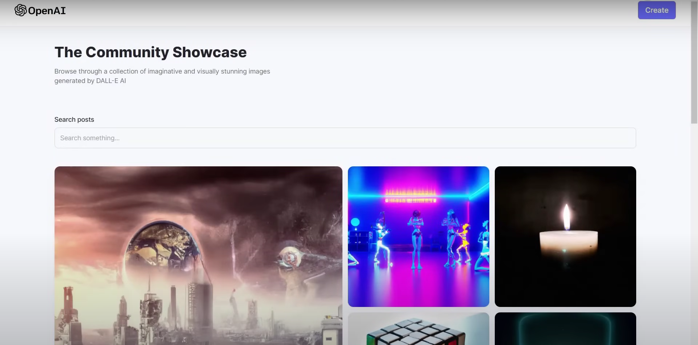
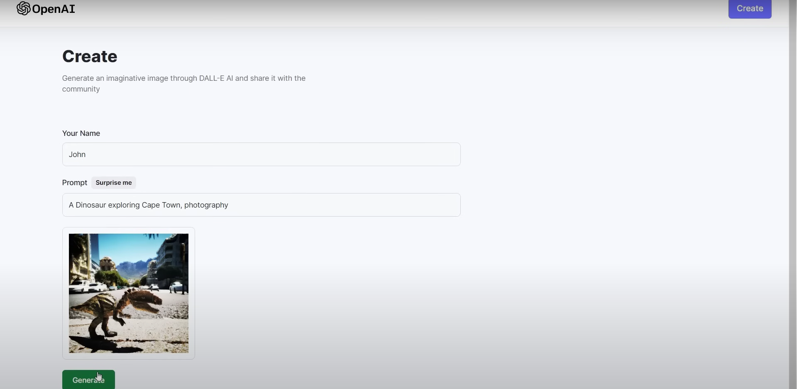
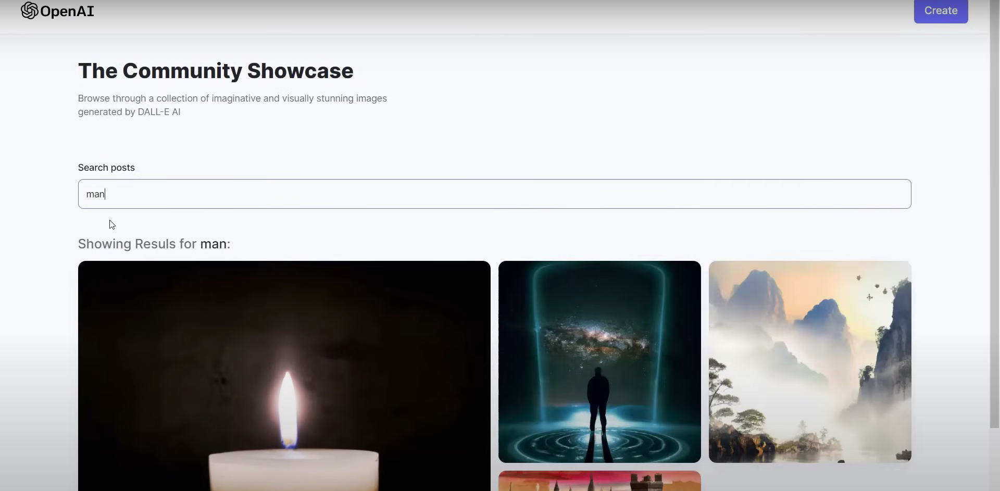

# PixelPrompt

**Transform words into art — instantly.**

PixelPrompt is an AI-powered image generation web app built using the MERN stack and DALL·E API. Just type in a prompt and watch the AI create stunning visuals. You can also explore what others have created and share your own images with the community.

🌐 **Live Site:** [click here to try it out](https://pixel-prompt-sigma.vercel.app)

⚠️ **Note:** Due to OpenAI API restrictions (now paid), image generation is currently disabled. The rest of the site remains functional for viewing.

---

## Features

- Generate images using DALL·E by typing in any prompt
- "Surprise Me" feature to spark creativity with random prompts
- Share your AI-generated images with the community
- Responsive and minimal user interface
- Image hosting via Cloudinary

---

## 🛠️ Tech Stack

- **Frontend:** React.js, Tailwind CSS
- **Backend:** Node.js, Express.js
- **Database:** MongoDB
- **AI API:** OpenAI (DALL·E)
- **Storage & Auth:** Appwrite
- **Image Uploads:** Cloudinary

---

## UI

### 🏠 Home Page


### 🧠 Generate Image


### 🌍 Search


---

## 🚀 Getting Started

```bash
# Clone the repository
git clone https://github.com/your-username/pixelprompt.git
cd pixelprompt

# Install dependencies for client and server
cd client
npm install
cd ../server
npm install

# Set up environment variables (OpenAI key, Cloudinary, Appwrite, etc.)

# Start the backend
cd ../server
npm run start

# In a new terminal, start the frontend
cd ../client
npm run dev
